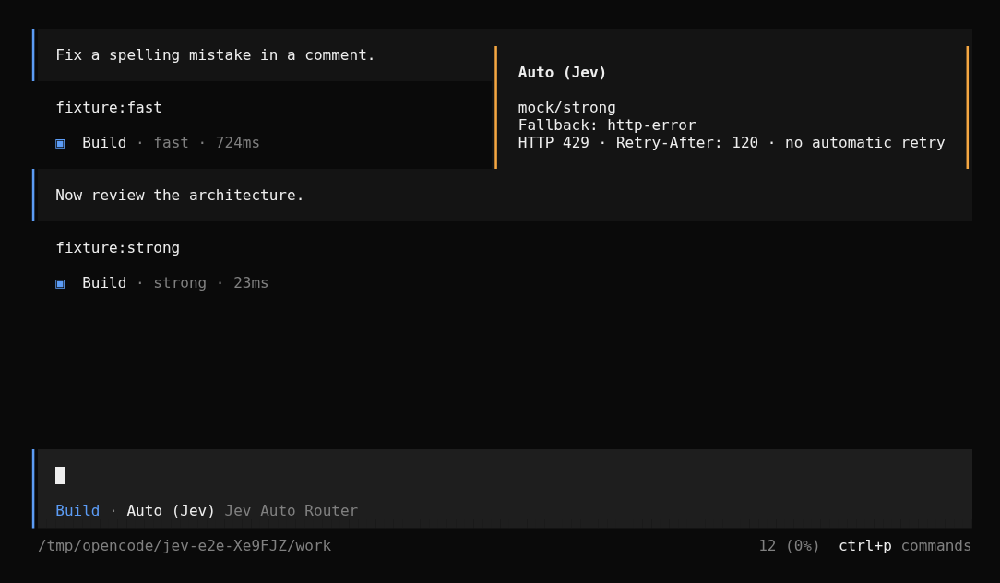

# opencode-plugin-jev-auto-model-router

An opt-in `Auto` model for OpenCode. When you pick `Auto (Jev)`
(`jev-router/auto`), the plugin asks a TypeSafe classifier to choose one model
from a candidate allowlist you define. It runs once per user turn. Every other
model, agent, and setting in OpenCode keeps working as before.

**Status: beta, install from a checkout.** Source is available on
[GitHub](https://github.com/purplesmoke05/opencode-plugin-jev-auto-model-router).
This plugin is not published to npm. The supported target is OpenCode `1.18.31` (peer range
`>=1.18.31 <1.19.0`); newer builds are untested. Compatibility with
oh-my-openagent is not fully validated, so don't treat this as production-ready.

**OpenCode 1.18.31 TUI caveat:** entering a new or reopened session can reset
the model picker to the first routed model. Open `/models` in that session and
select `Auto (Jev)` again. See [TUI selection](#tui-selection) before relying on
continuous routing. The plugin does not silently override manual model choices.


_Real OpenCode TUI driven against a local mock Jev endpoint and local mock
model endpoints. The screenshot demonstrates the UI and the routing behavior,
not the quality or latency of any live model or of the hosted Jev service._

## What it does

The plugin registers a virtual provider, `jev-router`, with a single model,
`auto`, shown in the picker as `Auto (Jev)`. That provider has no real
endpoint. If a request ever reaches it, the plugin throws instead of sending
anything upstream.

On each user turn where `Auto (Jev)` is selected, the `chat.message` hook:

1. Filters your candidate allowlist against the connected model registry, so
   only models that are connected, advertise tool calling, and accept every
   modality in the turn remain.
2. Sends the current turn's non-synthetic user text and the candidate
   descriptions to TypeSafe.
3. Rewrites the turn's model to the chosen candidate when TypeSafe returns one
   with confidence at or above the threshold, or to your fallback candidate
   otherwise.
4. Leaves the agent unchanged, so permissions and behavior match any other
   model choice.

The rewrite happens once, before the turn executes. Tool calls made during the
turn stay on the selected model; the model is never changed mid-tool.

## Configuration

Register the plugin in `opencode.json` / `opencode.jsonc` as a tuple with your
options:

```json
{
  "plugin": [
    [
      "file:///absolute/path/to/opencode-plugin-jev-auto-model-router/dist/index.js",
      {
        "candidates": [
          { "model": "anthropic/claude-sonnet-4-5", "description": "General coding and edits" },
          { "model": "openai/gpt-5", "description": "Hard reasoning and architecture", "variant": "high" },
          { "model": "openai/gpt-5-mini", "description": "Small, low-risk changes" }
        ],
        "fallback": "openai/gpt-5"
      }
    ]
  ]
}
```

Each `model` is a `provider/model` reference that must exist and be
authenticated on your OpenCode instance. The plugin only sees the connected
registry, so a candidate that is not connected is dropped before the decision
is made. Candidate references can't point back at `jev-router/auto`, and the
fallback must be one of the candidates.
If your OpenCode config sets `enabled_providers`, include `jev-router` and your
candidate providers there. This plugin does not change that allowlist.

| Option | Default | Description |
| --- | --- | --- |
| `candidates` | required | 1 to 16 entries of `{ model, description, variant? }`. Models must be unique. `description` is what Jev compares candidates against, so make it specific. |
| `fallback` | required | One of the candidates. Used for every fallback path. |
| `agents` | `["build", "quick"]` | Agent names Auto may route. Other agents fall back. |
| `confidenceThreshold` | `0.7` | Minimum Jev confidence to accept a choice. |
| `timeoutMs` | `5000` | Client-side budget for the Jev request. |
| `maxPromptChars` | `12000` | Turns with more text than this fall back without calling Jev. |
| `notify` | `true` | Show a routing toast. Metadata-only OpenCode logging remains enabled when this is false. |

Defaults come from `src/config.ts`. The `0.7` confidence default is a starting
policy, not a calibrated measure of model quality. Raising it makes Jev defer
to the fallback more often; it does not make the choice better. The `timeoutMs`
default is a client-side budget for the classification request, not a latency
promise from TypeSafe.

## Routing and fallback

The turn runs on the fallback candidate without calling TypeSafe when:

- the session is a child/subagent session, or the agent is not in `agents`
  (`scope-fallback`)
- the turn has no non-synthetic user text (`synthetic-fallback`)
- the user text is empty (`empty-prompt`)
- the user text exceeds `maxPromptChars` (`prompt-too-long`)
- `TYPESAFE_API_KEY` is empty (`missing-key`)

TypeSafe is called only for eligible turns. The turn falls back when the call
returns an HTTP error including `429` (`http-error`), a malformed or unparseable
response (`invalid-response`), a timeout (`timeout`), or a network error
(`network-error`). It also falls back when Jev picks a model outside the
candidate set (`invalid-choice`) or below the confidence threshold
(`low-confidence`).

There is no automatic retry. The TypeSafe client sends a single request
(`retry: 0`). On `429`, the response's `Retry-After` header, when present, is
sanitized and attached to the routing log and the notification toast. The
plugin does not wait or retry on your behalf; it routes the turn to the
fallback and reports the status.

If the fallback candidate is itself unavailable, not connected, lacks tool
calling, or can't accept the turn's modalities, the plugin blocks the turn with
a `RoutingError` instead of quietly choosing a different model. The same
happens when the whole candidate list is filtered out.

## Capability filtering

Candidates are compared against OpenCode's connected provider catalog. A model
is eligible only when it is connected, advertises tool calling, and its input
modalities include every modality in the turn. Turn modalities come from the
current message's attachments plus attachments already seen in the session, so
a candidate that can't read a PDF or image is excluded before Jev sees it.
Unsupported attachment types are tracked as their own modality and excluded as
well.

## Privacy

What leaves your machine when Jev is called:

- the current user turn's non-synthetic text, joined into one string
- the candidate model IDs and their `description` strings

What is not intentionally sent:

- tool output, file contents, or other injected text
- synthetic or ignored message parts
- conversation history; only the latest turn is classified

Two caveats. If you paste a secret into your message, it is user text and it is
transmitted like any other prompt. Also, the plugin reads local session message
history to work out which attachment modalities the session has already used.
That read stays local and is used only for capability filtering; it is not part
of the request sent to TypeSafe.

The request goes directly to TypeSafe at
`https://api.typesafe.ai/v1/systemone`, authenticated with `TYPESAFE_API_KEY`.
This is TypeSafe's own REST API, not OpenRouter or any other gateway.

## Limitations

- No mid-tool model changes. Routing is decided once per user turn.
- No semantic memory. Jev sees only the current turn's text, not prior
  messages, so it can't reason about the conversation as a whole.
- Context windows are placeholders. The virtual Auto model advertises a
   32,000-token context and a 4,096-token output limit. Those numbers are
  placeholder metadata, not the real limits of the model that ends up running.
  OpenCode resolves the real model for execution. Automatic compaction and
  synthetic continuation paths have not been validated end to end.
- Subagents are not routed. A child session with an explicit model is
  untouched. A child session that inherits Auto resolves to the fixed fallback
  candidate without calling Jev.
- Not universal routing. The plugin only affects the `jev-router/auto` model.
  It does not route other models, providers, or agents.

## TUI selection

OpenCode 1.18.31 hydrates its local model picker from the last user message when
entering a session. That message contains the real execution model after routing.
Consequently, starting with Auto on the home screen, or reopening a routed
session, can leave the picker on the real model. Subsequent messages then bypass
Jev, exactly like any manual model selection.

After the session opens, use `/models` and select `Auto (Jev)` again. Routing
works on subsequent turns while the picker remains on Auto. In the tested
two-turn TUI scenario, reselecting Auto routed the second turn to the fallback
after a mock HTTP 429. CLI same-session continuation is separately covered by
the real-binary E2E tests.




Both images use local mock endpoints. Neither is a live-model performance
measurement. Keeping Auto selected automatically across TUI session hydration
requires an upstream selection/execution-model separation; this server-only
plugin deliberately does not guess whether a real-model selection was manual.

## oh-my-openagent compatibility

If you use oh-my-openagent (OMO), place this plugin's tuple after the OMO entry
in the `plugin` array. The hook only rewrites the model when the turn is still
on `jev-router/auto`, so an override made by an earlier plugin is respected and
this plugin does nothing.

Current OMO compatibility is not fully validated. Treat it as beta and verify
your own setup before relying on it.

## Install

Clone the repository, enter its directory, then install and build:

```bash
git clone https://github.com/purplesmoke05/opencode-plugin-jev-auto-model-router.git
cd opencode-plugin-jev-auto-model-router
bun install
bun run build
```

The build emits `dist/index.js`. Register the plugin using a tuple with your
options, as shown under [Configuration](#configuration). Set
`TYPESAFE_API_KEY` in the environment OpenCode runs in, restart OpenCode, and
select `Auto (Jev)` from the model picker. If `TYPESAFE_API_KEY` is missing,
Auto still works but always runs the fallback.

Load the plugin only once. Registering it twice makes the `config` hook throw,
because `jev-router` is already defined.

## Development

```bash
bun run lint        # biome check
bun run typecheck   # tsc --noEmit
bun run test        # bun test tests
bun run build       # tsc -p tsconfig.build.json
bun run check       # lint + typecheck + test + build
bun run test:e2e    # real OpenCode 1.18.31 + local mock HTTP/SSE servers
bun run demo        # isolated interactive TUI; no real credentials or provider calls
```

The repository includes tests for configuration parsing, the routing policy,
the TypeSafe client, and the OpenCode hooks. End-to-end fixtures live under
`tests/support` and remain opt-in; `bun run check` does not require an OpenCode
binary. `bun run test:e2e` requires OpenCode 1.18.31 on PATH (or
`OPENCODE_E2E_BINARY`) and does not call live providers. It isolates HOME, XDG
directories, configuration, and credentials under `/tmp/opencode`.

An optional live connection check sends one generic, non-private prompt to
TypeSafe, with hypothetical candidate labels. It never calls a coding model
and may incur a TypeSafe API charge:

```sh
bun run scripts/live-smoke.ts
```

To reproduce the main screenshot, install Chrome/Chromium (or set `CHROME_BIN`):

```sh
bun run scripts/capture-terminal.ts \
  --command 'bun run scripts/demo.ts' \
  --ready 'Auto (Jev)' \
  --input 'Fix a spelling mistake in a comment.' --input '{Enter}' \
  --wait 'fixture:fast' --output docs/usage.png
```

The capture runs the real TUI in a PTY and renders its byte stream through
xterm.js. It creates PNG and text/ANSI evidence; do not use it on private sessions.

## License

MIT. See [LICENSE](LICENSE).
