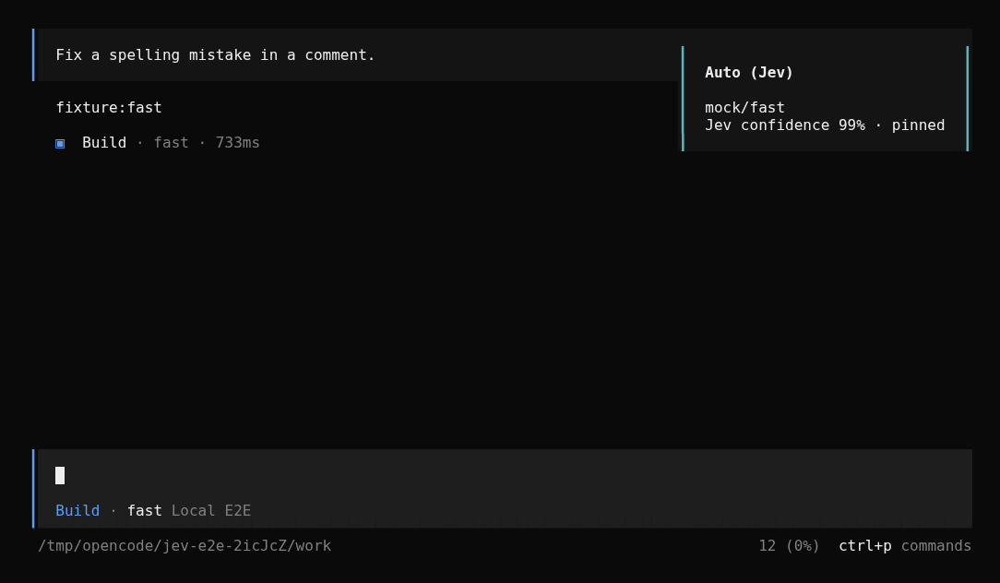
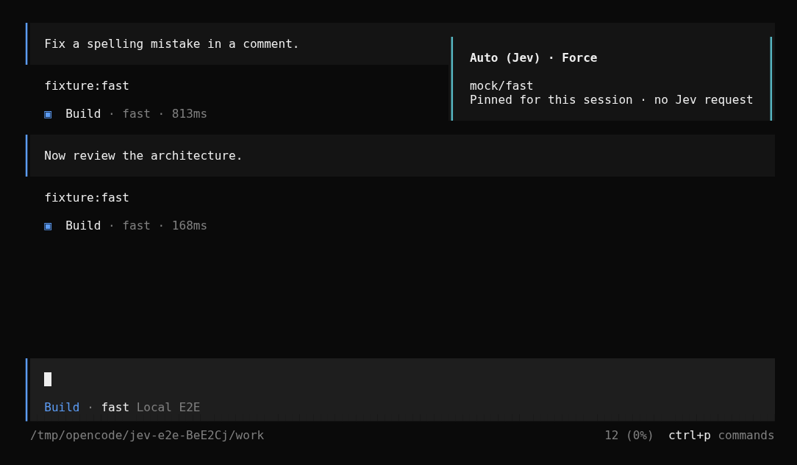
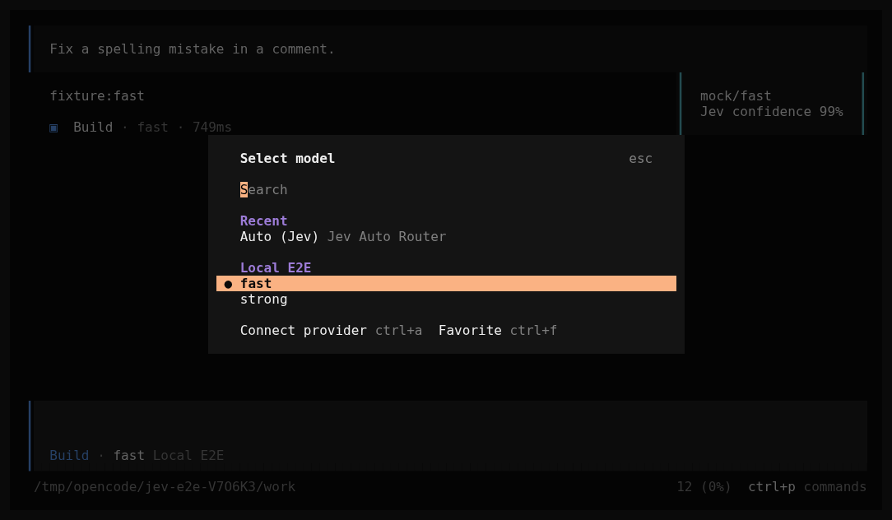

# opencode-plugin-jev-auto-model-router

Jev-based model selection for OpenCode, with two modes: opt-in `Auto (Jev)`
(`jev-router/auto`), or an explicit force mode that overrides ordinary main
and delegated task model selections. Jev chooses from your configured candidate
allowlist until a decision reaches the sticky-confidence threshold (99% by
default). That model is then fixed for the session; later turns do not call Jev
again. The plugin preserves the agent, tools, and permissions.

**Status: beta, install from a checkout.** Source is available on
[GitHub](https://github.com/purplesmoke05/opencode-plugin-jev-auto-model-router).
This plugin is not published to npm. The supported target is OpenCode `1.18.31` (peer range
`>=1.18.31 <1.19.0`); newer builds are untested. Compatibility with
oh-my-openagent is not fully validated, so don't treat this as production-ready.

**Auto-mode TUI caveat in OpenCode 1.18.31:** entering a new or reopened session can reset
the model picker to the routed model. If it is already pinned, no further Jev
decision is needed. Otherwise reselect Auto to continue evaluating. Auto mode preserves manual model choices. Force mode
deliberately overrides them, so it does not require Auto to remain selected.



_Real OpenCode TUI driven against a local mock Jev endpoint and local mock
model endpoints. The screenshot demonstrates the UI and the routing behavior,
not the quality or latency of any live model or of the hosted Jev service._

## What it does

The plugin registers a virtual provider, `jev-router`, with a single model,
`auto`, shown in the picker as `Auto (Jev)`. That provider has no real
endpoint. If a request ever reaches it, the plugin throws instead of sending
anything upstream.

On routed user turns before a model is pinned, the `chat.message` hook:

1. Filters your candidate allowlist against the connected model registry, so
   only models that are connected, advertise tool calling, and accept every
   modality in the turn remain.
2. Sends the current request, the latest visible assistant reply when available,
   and the candidate descriptions to TypeSafe.
3. Rewrites the turn's model to the chosen candidate when TypeSafe returns one
   with confidence at or above the threshold, or to your fallback candidate
   otherwise.
4. Leaves the agent unchanged, so permissions and behavior match any other
   model choice.

When Jev selects a model with confidence at or above the sticky threshold, that
provider/model/variant is stored per session. Later ordinary turns reuse it
without asking Jev, even when the task gets harder or easier. New sessions
(including new child sessions) qualify their own decisions independently.

## Conversation context

Each decision before pinning sees **one exchange only**: the latest visible assistant
reply, if there is one, and the current user answer. On a fresh session without
an assistant reply, only the current request is available. After pinning, no
further context is sent to Jev.

The structured `state` contains `current_request` and `task_context`:

- `previous_assistant`: the latest eligible assistant reply, bounded in size.
- `truncated`: whether that reply had to be shortened.

There is no session-origin text, older conversation, compaction summary, tool
output, reasoning, parent history, or summarization-model call. This is not a
full understanding of the ongoing task; it is the deliberately minimal input
used for each decision until the session qualifies for a pin.

By default the serialized context object is limited to **4,000 characters**.
This is separate from the current request's
`maxPromptChars` limit, and is a character budget, not a measured token count.
Only the current session is used. Delegated sessions receive their own task
prompt plus their own latest assistant reply, if any.

```json
"context": {
  "enabled": true,
  "maxCharacters": 4000
}
```

Set `"context": { "enabled": false }` and restart to send only the current
request. Metadata-only routing logs report `contextCharacters`,
`contextMessages`, and `contextTruncated` for decision requests; the actual
conversation text is not logged by this plugin.

## Sticky sessions

`"sticky": true` and `"stickyConfidenceThreshold": 0.99` are the defaults.
The first accepted Jev choice with **unrounded confidence >= 0.99** is pinned.
Before that, each eligible turn is evaluated again. A valid choice below 0.99
can be used for that turn, but is not pinned. Timeout, HTTP error, missing-key,
and low-confidence fallbacks are **not** pinned.

**From the qualifying decision onward, later ordinary turns make zero Jev
requests.** Reopening the same session or restarting OpenCode keeps the pin.
There is no time-based expiry. The existing `confidenceThreshold` still controls
whether a decision is accepted for the current turn; it is separate from the
stricter pinning threshold. Changing thresholds does not re-evaluate an existing pin.

Pins contain model metadata only and live under
`$XDG_STATE_HOME/opencode/jev-router/sessions-confidence/` (normally
`~/.local/state/opencode/jev-router/sessions-confidence/`). They do not store prompts, replies,
or API keys. Session deletion removes its pin when the plugin receives the event.
If a pinned model is removed, disconnected, or cannot accept new attachments,
the plugin stops rather than silently choosing another model. Start a new
session or set `"sticky": false` to return to per-turn routing. Disabling sticky
does not erase existing pins.

Earlier unconditional pins in the old `sessions/` directory are not read by
this policy: they have no qualifying-confidence evidence. They are left intact,
and those sessions qualify afresh after restarting with this version.

The exception is OMO execution-error recovery: a marked retry keeps OMO's model
and updates an existing pin to that recovery model, without calling Jev. This
prevents the next normal turn from switching back to the failing model.

Staying on one model avoids router-induced cache disruption, but does not
guarantee provider prompt-cache hits or discounts.

## Force mode

Add `"mode": "force"` to the plugin options to let Jev choose the model for
ordinary main and subagent task prompts, even when the user or OMO specified
a concrete model. OMO still chooses the agent/category and supplies its prompt
and permissions; Jev chooses the execution model. The `agents` allowlist applies
only in `"auto"` mode and is ignored in `"force"` mode.

The same candidate list, acceptance threshold, timeout, and fallback apply
until a qualifying selection is pinned. Subsequent turns use the session pin.
Set `"mode": "auto"` (the default) and restart OpenCode to return to opt-in routing.

Force mode deliberately leaves these alone:

- Internal `title`, `summary`, and `compaction` agent turns.
- Synthetic continuations, main-session internal notifications, and child
  notifications marked as no-reply. OMO also marks ordinary delegated task
  prompts as internal; those child task prompts are routed, not discarded.
- OMO execution-error retry messages identified by its explicit
  `OMO_RUNTIME_FALLBACK_RETRY` marker on synthetic/internal-only text parts.
- Further model requests inside the same tool loop; a new task prompt is routed
  once, not after every tool result.

The marker contract was checked against OMO `5.0.0-beta.65`. No generic error
words are used to identify retries. OMO remains responsible for execution-error
recovery, and its recovery model may be outside the Jev candidate list. This is
a selection policy, not a provider-access security boundary.

The picker can show a concrete model while force mode remains active; that
selection is not a pin. Routing toasts show `Auto (Jev) · Force`, and routing
logs include the configured mode.



## Configuration

Register the plugin in `opencode.json` / `opencode.jsonc` as a tuple with your
options:

```json
{
  "plugin": [
    [
      "file:///absolute/path/to/opencode-plugin-jev-auto-model-router/dist/index.js",
      {
        "candidates": [
          { "model": "anthropic/claude-sonnet-4-5", "description": "General coding and edits" },
          { "model": "openai/gpt-5", "description": "Hard reasoning and architecture", "variant": "high" },
          { "model": "openai/gpt-5-mini", "description": "Small, low-risk changes" }
        ],
        "fallback": "openai/gpt-5"
      }
    ]
  ]
}
```

Each `model` is a `provider/model` reference that must exist and be
authenticated on your OpenCode instance. The plugin only sees the connected
registry, so a candidate that is not connected is dropped before the decision
is made. Candidate references can't point back at `jev-router/auto`, and the
fallback must be one of the candidates.
If your OpenCode config sets `enabled_providers`, include `jev-router` and your
candidate providers there. This plugin does not change that allowlist.

| Option | Default | Description |
| --- | --- | --- |
| `candidates` | required | 1 to 16 entries of `{ model, description, variant? }`. Models must be unique. `description` is what Jev compares candidates against, so make it specific. |
| `fallback` | required | One of the candidates. Used for every fallback path. |
| `mode` | `"auto"` | `"auto"` respects model selection; `"force"` overrides ordinary main and delegated task model choices. |
| `sticky` | `true` | Pin the first qualifying Jev choice per session; no Jev calls after pinning. |
| `stickyConfidenceThreshold` | `0.99` | Minimum unrounded Jev confidence to create a new pin. Fallbacks never qualify. |
| `agents` | `["build", "quick"]` | In auto mode, agent names Auto may route. Ignored in force mode. |
| `confidenceThreshold` | `0.7` | Minimum Jev confidence to accept a choice. |
| `timeoutMs` | `5000` | Client-side budget for the Jev request. |
| `maxPromptChars` | `12000` | Turns with more text than this fall back without calling Jev. |
| `context.enabled` | `true` | Include the latest visible assistant reply in each Jev request before pinning. |
| `context.maxCharacters` | `4000` | Hard serialized context-object character budget (1024–24000), separate from the current request. |
| `notify` | `true` | Show a routing toast. Metadata-only OpenCode logging remains enabled when this is false. |

Defaults come from `src/config.ts`. The `0.7` confidence default is a starting
policy, not a calibrated measure of model quality. Raising it makes Jev defer
to the fallback more often; it does not make the choice better. The `timeoutMs`
default is a client-side budget for the classification request, not a latency
promise from TypeSafe.

## Routing and fallback

The turn runs on the fallback candidate without calling TypeSafe when:

- in auto mode, the session is a child/subagent session, or the agent is not in `agents`
  (`scope-fallback`)
- in auto mode, the turn has no non-synthetic user text (`synthetic-fallback`)
- the user text is empty (`empty-prompt`)
- the user text exceeds `maxPromptChars` (`prompt-too-long`)
- `TYPESAFE_API_KEY` is empty (`missing-key`)

TypeSafe is called only for eligible turns. The turn falls back when the call
returns an HTTP error including `429` (`http-error`), a malformed or unparseable
response (`invalid-response`), a timeout (`timeout`), or a network error
(`network-error`). It also falls back when Jev picks a model outside the
candidate set (`invalid-choice`) or below the confidence threshold
(`low-confidence`).

There is no automatic retry. The TypeSafe client sends a single request
(`retry: 0`). On `429`, the response's `Retry-After` header, when present, is
sanitized and attached to the routing log and the notification toast. The
plugin does not wait or retry on your behalf; it routes the turn to the
fallback and reports the status.

If the fallback candidate is itself unavailable, not connected, lacks tool
calling, or can't accept the turn's modalities, the plugin blocks the turn with
a `RoutingError` instead of quietly choosing a different model. The same
happens when the whole candidate list is filtered out.

## Capability filtering

Candidates are compared against OpenCode's connected provider catalog. A model
is eligible only when it is connected, advertises tool calling, and its input
modalities include every modality in the turn. Turn modalities come from the
current message's attachments plus attachments already seen in the session, so
a candidate that can't read a PDF or image is excluded before Jev sees it.
Unsupported attachment types are tracked as their own modality and excluded as
well.

## Privacy

What leaves your machine when Jev is called:

- the current user turn's non-synthetic text, joined into one string
- the candidate model IDs and their `description` strings
- when context is enabled, the latest visible assistant reply within the
  configured bound; older messages are not included

In force mode, the text can also be a delegated task prompt authored by OMO or
another parent agent. Those prompts can contain code or repository context;
enabling force mode opts those task prompts into transmission to TypeSafe too.

What is excluded from context:

- raw tool inputs, outputs, error bodies, attachments, and reasoning parts
- synthetic or ignored message parts and OMO retry/no-reply notifications
- older conversation, compaction summaries, parent/sibling histories, and
  content fetched directly from repository files

User/assistant prose and delegated task prompts can still
contain pasted code or secrets. There is no general-purpose secret redaction:
do not enable context for conversations you cannot send to TypeSafe. The host
also reads local history for attachment compatibility; attachment contents are
not added to the classifier request by the context builder.

The request goes directly to TypeSafe at
`https://api.typesafe.ai/v1/systemone`, authenticated with `TYPESAFE_API_KEY`.
This is TypeSafe's own REST API, not OpenRouter or any other gateway.

## Limitations

- No mid-tool model changes. Routing is decided once per user turn.
- Each decision has only the latest assistant reply and current request.
  It can miss earlier context. After pinning, sticky mode intentionally does not
  reconsider the choice as the work changes; use a new session for a new decision.
- Context windows are placeholders. The virtual Auto model advertises a
   32,000-token context and a 4,096-token output limit. Those numbers are
  placeholder metadata, not the real limits of the model that ends up running.
  OpenCode resolves the real model for execution. Automatic compaction and
  synthetic continuation paths have not been validated end to end.
- In auto mode, subagents are not routed. A child session with an explicit model is
  untouched. A child session that inherits Auto resolves to the fixed fallback
  candidate without calling Jev.
- Force mode is not interception of every LLM call. The exclusions above remain
  outside routing, and automatic compaction is still handled by OpenCode.

## TUI selection

The following caveat concerns opt-in auto mode, not forced routing.
OpenCode 1.18.31 hydrates its local model picker from the last user message when
entering a session. That message contains the real execution model after routing.
Consequently, starting with Auto on the home screen, or reopening a routed
session, can leave the picker on the real model. Subsequent messages then bypass
Jev, exactly like any manual model selection.

Once a model is pinned, it does not need reclassification. Reselecting Auto
reuses that session's pin. Before pinning, reselect Auto to keep evaluating. With
`"sticky": false`, reselect Auto inside the session to request per-turn routing.



The images use local mock endpoints. They are not live-model performance
measurement. Keeping Auto selected automatically across TUI session hydration
requires an upstream selection/execution-model separation; this server-only
plugin deliberately does not guess whether a real-model selection was manual.

## oh-my-openagent compatibility

If you use oh-my-openagent (OMO), place this plugin's tuple after the OMO entry
in the `plugin` array. In auto mode, the hook rewrites the model only while it is
still on `jev-router/auto`; an earlier OMO override is respected. In force mode,
ordinary OMO choices are deliberately overwritten, while marked internal
retries are preserved. Later model-mutating plugins can still overwrite Jev's
choice; place this router after other ordinary model selectors.

An isolated OpenCode 1.18.31 + OMO 5.0.0-beta.65 test covers forced primary
routing, an actual OMO `task` delegation with a pinned child model, and preservation
of retry/internal-notification markers. OMO runtime fallback is enabled in that
fixture, but retries are injected marker messages; real upstream failure and
recovery, Sisyphus orchestration, MCPs, and automatic continuation are not fully
validated. Treat it as beta and verify your own setup before relying on it.

With force mode, keep a concrete default model in OpenCode/OMO; selecting the
virtual Auto model is unnecessary. Internal OMO paths that do not pass through
the routing hook still need a real model to execute.

## Install

Clone the repository, enter its directory, then install and build:

```bash
git clone https://github.com/purplesmoke05/opencode-plugin-jev-auto-model-router.git
cd opencode-plugin-jev-auto-model-router
bun install
bun run build
```

The build emits `dist/index.js`. Register the plugin using a tuple with your
options, as shown under [Configuration](#configuration). Set
`TYPESAFE_API_KEY` in the environment OpenCode runs in, restart OpenCode, and
select `Auto (Jev)` from the model picker. If `TYPESAFE_API_KEY` is missing,
Auto still works but always runs the fallback.

Load the plugin only once. Registering it twice makes the `config` hook throw,
because `jev-router` is already defined.

## Development

```bash
bun run lint        # biome check
bun run typecheck   # tsc --noEmit
bun run test        # bun test tests
bun run build       # tsc -p tsconfig.build.json
bun run check       # lint + typecheck + test + build
bun run test:e2e    # real OpenCode 1.18.31 + local mock HTTP/SSE servers
bun run demo        # isolated interactive TUI; no real credentials or provider calls
```

The repository includes tests for configuration parsing, the routing policy,
the TypeSafe client, and the OpenCode hooks. End-to-end fixtures live under
`tests/support` and remain opt-in; `bun run check` does not require an OpenCode
binary. `bun run test:e2e` requires OpenCode 1.18.31 on PATH (or
`OPENCODE_E2E_BINARY`) and does not call live providers. It isolates HOME, XDG
directories, configuration, and credentials under `/tmp/opencode`.

The additional real-OMO suite is optional and uses only local mock model APIs:

```sh
OPENCODE_E2E=1 \
OPENCODE_E2E_OMO_PLUGIN=/absolute/path/to/oh-my-openagent/dist/index.js \
bun test tests/omo-e2e.test.ts
```

An optional live connection check sends one generic, non-private prompt to
TypeSafe, with hypothetical candidate labels. It never calls a coding model
and may incur a TypeSafe API charge:

```sh
bun run scripts/live-smoke.ts
```

To reproduce the main screenshot, install Chrome/Chromium (or set `CHROME_BIN`):

```sh
bun run scripts/capture-terminal.ts \
  --command 'bun run scripts/demo.ts' \
  --ready 'Auto (Jev)' \
  --input 'Fix a spelling mistake in a comment.' --input '{Enter}' \
  --wait 'fixture:fast' --output docs/usage.png
```

The capture runs the real TUI in a PTY and renders its byte stream through
xterm.js. It creates PNG and text/ANSI evidence; do not use it on private sessions.

## License

MIT. See [LICENSE](LICENSE).
